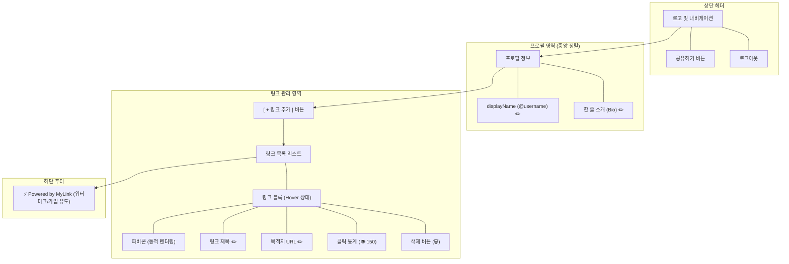

# 마이링크 (MyLink) 와이어프레임

이 문서는 마이링크 서비스의 UI/UX 구조를 시각적으로 보여주는 와이어프레임 설계 문서입니다. 소유자의 'WYSIWYG (단일 페이지 기반)' 편집 방식과 데스크톱 반응형 레이아웃, 그리고 제안해 주신 디자인 요소들을 모두 반영했습니다.

---

## 1. 화면 구조 (Mermaid 다이어그램)

페이지의 전반적인 컴포넌트 계층 구조를 보여줍니다.



---

## 2. ASCII 아트 와이어프레임

실제 화면 배치(Layout)와 사용자 경험(UX)을 직관적으로 보여주는 ASCII 와이어프레임입니다. 데스크톱 와이드 화면을 가정하여 작성되었습니다.

### 2.1. 소유자 화면 (관리자 로그인 상태)
소유자가 자신의 페이지에 접속했을 때 보이는 인라인 편집 모드입니다. 마우스를 올렸을 때(Hover) 연필 아이콘과 점선 테두리가 활성화됩니다.

```text
+-----------------------------------------------------------------------------------------+
|  MyLink                                                               [공유하기] [로그아웃] |
+-----------------------------------------------------------------------------------------+
|                                                                                         |
|                                                                                         |
|                                      @jane_doe [✏️]                                      |
|                            프론트엔드 개발자입니다. 환영합니다! [✏️]                            |
|                                                                                         |
|                                                                                         |
|                             +-------------------------------+                           |
|                             |         + 링크 추가하기         |                           |
|                             +-------------------------------+                           |
|                                                                                         |
|                                                                                         |
|      +---------------------------------------------------------------------------+      |
|      | [G] 나의 GitHub [✏️]                                              🗑️ [👁 150] |      |
|      |     https://github.com/janedoe [✏️]                                       |      |
|      +---------------------------------------------------------------------------+      |
|                                                                                         |
|      +---------------------------------------------------------------------------+      |
|      | [T] 기술 블로그 (Hover 상태) ........................................ 🗑️ [👁 45]  |      |
|      |     https://velog.io/@janedoe .......................................     |      |
|      +---------------------------------------------------------------------------+      |
|                                                                                         |
|      +---------------------------------------------------------------------------+      |
|      | [인라인 편집 중 상태]                                                         |      |
|      | [N] [ 제목 입력...________ ]  [ https://..._____________ ]        ✅ 취소  |      |
|      +---------------------------------------------------------------------------+      |
|                                                                                         |
|                                                                                         |
|                                                                                         |
|                                ⚡️ 나만의 마이링크 만들기                                 |
+-----------------------------------------------------------------------------------------+
```
- **특징 1:** 방문자와 동일한 화면(WYSIWYG)을 유지하면서 편집 기능만 추가 노출됩니다.
- **특징 2:** 항목 위로 마우스를 올리면 수정 가능한 텍스트 옆에 ✏️ 아이콘이 나타나 직관적인 편집을 유도합니다.
- **특징 3:** 각 링크 블록 우측 하단에 소유자만 볼 수 있는 눈동자(👁) 아이콘과 누적 클릭 수가 표시됩니다.

<br>

### 2.2. 방문자 화면 (공개 페이지)
일반 사용자가 `mylink.com/jane_doe` 로 접속했을 때 보이는 깔끔한 화면입니다. 편집 버튼과 통계가 모두 숨겨집니다.

```text
+-----------------------------------------------------------------------------------------+
|                                                                                         |
|                                                                                         |
|                                                                                         |
|                                                                                         |
|                                      @jane_doe                                          |
|                            프론트엔드 개발자입니다. 환영합니다!                                 |
|                                                                                         |
|                                                                                         |
|                                                                                         |
|      +---------------------------------------------------------------------------+      |
|      |                                                                           |      |
|      | [G] 나의 GitHub                                                           |      |
|      |                                                                           |      |
|      +---------------------------------------------------------------------------+      |
|                                                                                         |
|      +---------------------------------------------------------------------------+      |
|      |                                                                           |      |
|      | [T] 기술 블로그                                                             |      |
|      |                                                                           |      |
|      +---------------------------------------------------------------------------+      |
|                                                                                         |
|                                                                                         |
|                                                                                         |
|                                                                                         |
|                                ⚡️ 나만의 마이링크 만들기                                 |
+-----------------------------------------------------------------------------------------+
```
- **특징 1:** 오직 링크 이동이라는 핵심 목적에만 집중할 수 있도록 여백을 넓게 사용하고 깔끔하게 렌더링됩니다.
- **특징 2:** 링크 클릭 시 해당 목적지가 `새 탭(_blank)`으로 열리며 백그라운드에서 클릭 카운트가 증가합니다.
- **특징 3:** 최하단의 "⚡️ 나만의 마이링크 만들기"를 클릭하면 마이링크 서비스의 회원가입(랜딩) 페이지로 이동합니다.

---

### 3. 로그인 및 랜딩 페이지
서비스의 첫 인상인 로그인 화면입니다.

```text
+-----------------------------------------------------------------------------------------+
|  MyLink                                                                                 |
+-----------------------------------------------------------------------------------------+
|                                                                                         |
|                                                                                         |
|                                                                                         |
|                                    하나의 링크로                                        |
|                                모든 것을 연결하세요.                                     |
|                                                                                         |
|                                                                                         |
|                          +-----------------------------------+                          |
|                          |    [G] Google 계정으로 시작하기     |                          |
|                          +-----------------------------------+                          |
|                                                                                         |
|                                                                                         |
+-----------------------------------------------------------------------------------------+
```
